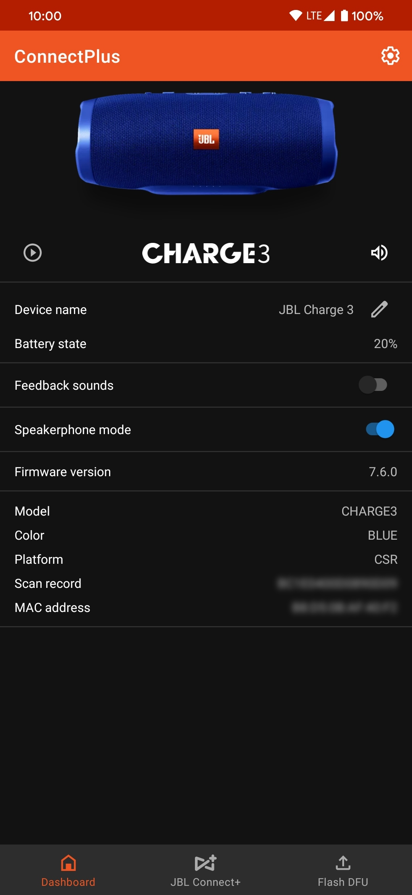
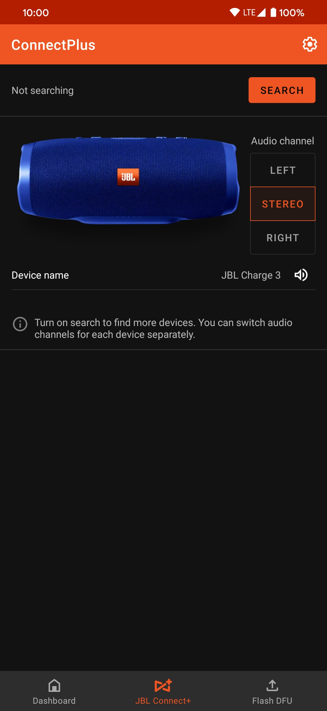
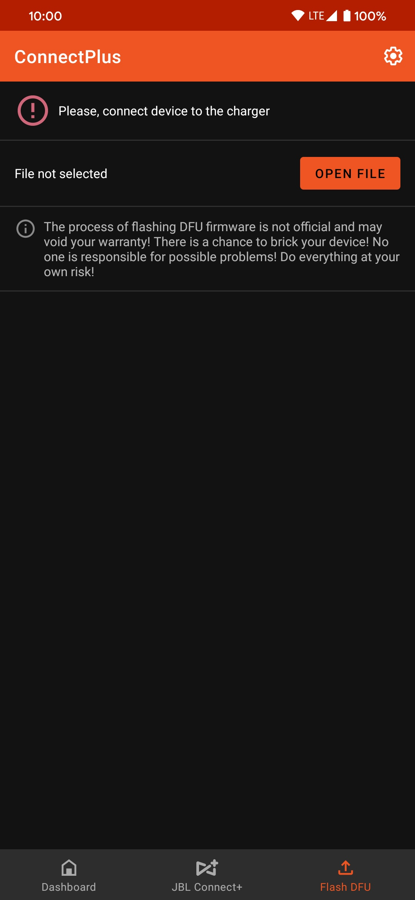
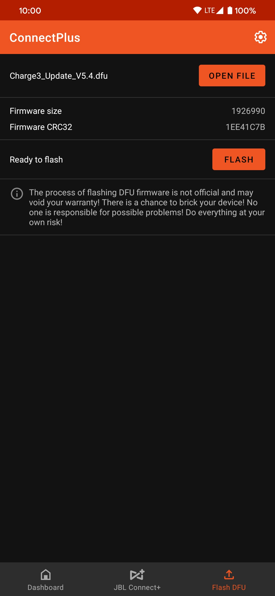
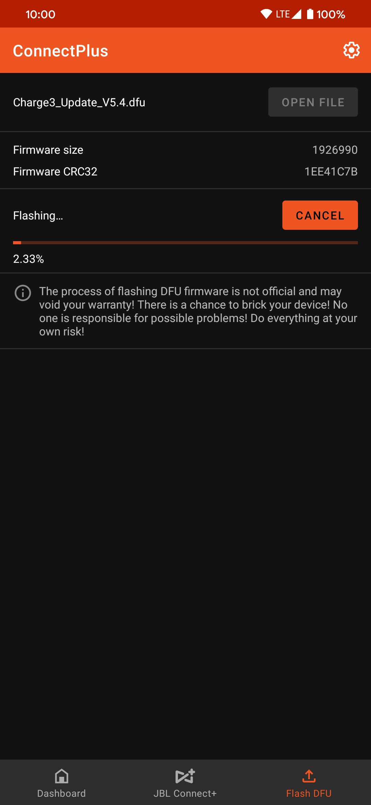

# ConnectPlus
ConnectPlus is an Android app for connecting to and configuring JBL Bluetooth speakers with additional functionality compared to the official app, like flashing custom firmware and stereo audio playback when using different speaker models.

## Features
 - View and change speaker information and configuration
 - Set audio channel for each speaker individually 
 - Flash custom firmware files

|  |  |  |  |
| --- | --- | --- | --- |

 
## Flashing firmware

_**Do this at your own risk!**_

Note: Firmware flashing was only tested on speakers with CSR chipsets and may not work in other cases. 

1. Prepare the firmware file, open the app and make sure it's connected to your speaker. You can find a list of firmware files [here](https://github.com/pembem22/jbl-firmware/).
2. On the "Flash DFU" screen, open the firmware file and connect the speaker to a charger.
3. Start flashing. The initialization step should take a few seconds, and the app will start uploading the firmware.
4. After that, the speaker will start flashing the received file to its memory. Do not disable/reboot/unplug it in this stage, even if it seems nothing is happening, as that can brick the speaker. The app is not needed anymore and can be safely closed.
5. After a few minutes, the speaker should turn on with the new firmware.

|  |  |  |
| --- | --- | --- |
